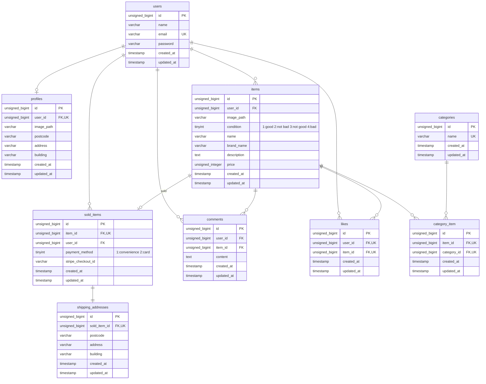

# フリマアプリ

## 環境構築

### Docker ビルド
```bash
git clone git@github.com:sappy3105/fleamarket-app.git
cd fleamarket-app
docker-compose up -d --build
```

### Laravel 環境構築

```bash
docker-compose exec php bash
composer install
cp .env.example .env
```

`.env`ファイルに以下の環境変数を追加してください。

```env
DB_CONNECTION=mysql
DB_HOST=mysql
DB_PORT=3306
DB_DATABASE=laravel_db
DB_USERNAME=laravel_user
DB_PASSWORD=laravel_pass
```

### STRIPE決済システムの設定

本プロジェクトでは決済機能に [Stripe](https://stripe.com/jp) を使用しています。
開発環境（テストモード）で動作させるには、以下の手順でキーを設定してください。

**1. APIキーの取得**

1. [Stripe公式サイト](https://stripe.com/jp)でアカウントを作成します。
2. [Stripeダッシュボード](https://dashboard.stripe.com/login)にログインし、画面左上のアカウント名が「サンドボックス（またはテスト用のアカウント名）」になっていることを確認します。
3. 画面上部の「検索」窓に「APIキー」と入力し、検索結果から「開発者 ＞ APIキー」を選択します。
4. 表示された以下の2つのキーを控えておきます。
   - **公開可能キー** (Publishable key) : `pk_test_...`
   - **シークレットキー** (Secret key) : `sk_test_...`

**2. 環境設定 (.env)**

プロジェクト直下の `.env` ファイルに、取得したキーを反映させてください。

```env
STRIPE_KEY=pk_test_あなたの公開可能キー
STRIPE_SECRET=sk_test_あなたのシークレットキー
```

### 開発環境でのメール認証テスト (Mailtrap)

本プロジェクトでは、メール認証のテストに [Mailtrap](https://mailtrap.io/) を使用しています。
機能を再現するには、以下の手順で設定を行ってください。

**1. Mailtrap のセットアップ**

1. [Mailtrap公式サイト](https://mailtrap.io/)でアカウントを作成します。
2. ログイン後、左メニューの「Sandboxes」→「My Sandbox」をクリックします。
3. 中央の「Integration」タブが選択されていることを確認し、その下の「SMTP」を選択します。
4. 表示された `Credentials` 欄の `Username` と `Password` を確認します。

**2. 環境設定 (.env)**

プロジェクト直下の `.env` ファイルに、確認した値を反映させてください。

```env
MAIL_HOST=sandbox.smtp.mailtrap.io
MAIL_PORT=2525
MAIL_USERNAME=（確認したユーザー名）
MAIL_PASSWORD=（確認したパスワード）
```

### 環境変数の反映

Laravel環境構築およびStripe、Mailtrapの設定を `.env` に追記した後は、設定をアプリケーションに反映させるため、必ず以下のコマンドを実行してください。

```bash
docker-compose exec php bash
php artisan config:clear
```

### アプリケーションキーの作成

```bash
php artisan key:generate
```

### マイグレーションの実行

```bash
php artisan migrate
```

### シーディングの実行

```bash
php artisan db:seed
```

## 使用技術（実行環境）

- PHP 8.1.34
- Laravel 8.83.29
- MySQL 8.0.26
- nginx 1.21.1

## URL

- 開発環境： http://localhost/
- phpMyAdmin： http://localhost:8080/

## ER 図


```mermaid
erDiagram
users ||--o| profiles : ""
users ||--o{ items : ""
users ||--o{ sold_items : ""
users ||--o{ comments : ""
users ||--o{ likes : ""

items ||--o{ category_item : ""
categories ||--o{ category_item : ""
items ||--o| sold_items : "sold"
items ||--o{ comments : ""
items ||--o{ likes : ""

sold_items ||--|| shipping_addresses : ""

users {
    unsigned_bigint id PK
    varchar name
    varchar email UK
    varchar password
    timestamp created_at
    timestamp updated_at
}

profiles {
    unsigned_bigint id PK
    unsigned_bigint user_id FK,UK
    varchar image_path
    varchar postcode
    varchar address
    varchar building
    timestamp created_at
    timestamp updated_at
}

categories {
    unsigned_bigint id PK
    varchar name UK
    timestamp created_at
    timestamp updated_at
}

items {
    unsigned_bigint id PK
    unsigned_bigint user_id FK
    varchar image_path
    tinyint condition "1:good 2:not bad 3:not good 4:bad"
    varchar name
    varchar brand_name
    text description
    unsigned_integer price
    timestamp created_at
    timestamp updated_at
}

category_item {
    unsigned_bigint id PK
    unsigned_bigint item_id FK,UK
    unsigned_bigint category_id FK,UK
    timestamp created_at
    timestamp updated_at
}

likes {
    unsigned_bigint id PK
    unsigned_bigint user_id FK,UK
    unsigned_bigint item_id FK,UK
    timestamp created_at
    timestamp updated_at
}

comments {
    unsigned_bigint id PK
    unsigned_bigint user_id FK
    unsigned_bigint item_id FK
    text content
    timestamp created_at
    timestamp updated_at
}

sold_items {
    unsigned_bigint id PK
    unsigned_bigint item_id FK,UK
    unsigned_bigint user_id FK
    tinyint payment_method "1:convenience 2:card"
    varchar stripe_checkout_id
    timestamp created_at
    timestamp updated_at
}

shipping_addresses {
    unsigned_bigint id PK
    unsigned_bigint sold_item_id FK,UK
    varchar postcode
    varchar address
    varchar building
    timestamp created_at
    timestamp updated_at
}
```
