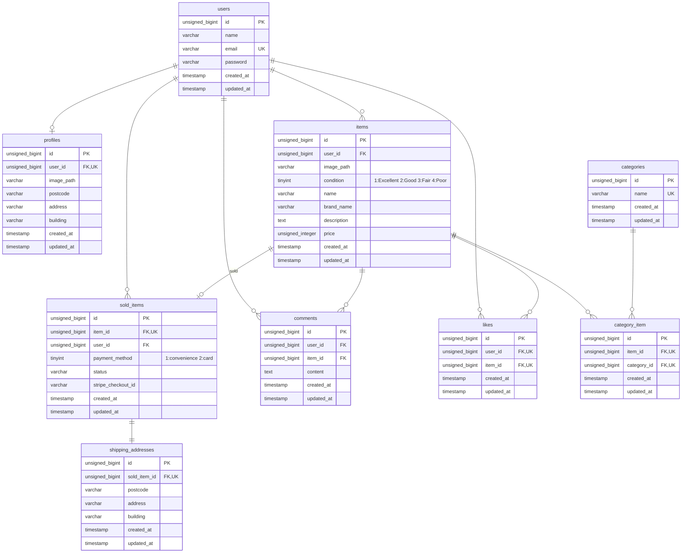

# フリマアプリ

## 環境構築

### 1. リポジトリのクローンと環境準備（ローカル環境）

1. プロジェクトをクローンし、Dockerコンテナを起動します。

```bash
git clone git@github.com:sappy3105/fleamarket-app.git
cd fleamarket-app
docker-compose up -d --build
```

2. `.env.example` をコピーして `.env` を作成し、環境準備をします。

```bash
docker-compose exec php bash
cp .env.example .env
```

### 2. 各種サービスの設定 (.env)

#### 2-1. データベース設定

`.env`ファイルに以下の環境変数を追加してください。

```env
DB_CONNECTION=mysql
DB_HOST=mysql
DB_PORT=3306
DB_DATABASE=laravel_db
DB_USERNAME=laravel_user
DB_PASSWORD=laravel_pass
```

#### 2-2. STRIPE決済システムの設定

本プロジェクトでは決済機能に [Stripe](https://stripe.com/jp) を使用しています。  
開発環境（テストモード）で動作させるには、以下の手順でキーを設定してください。

**1. APIキーの取得**

1. [Stripe公式サイト](https://stripe.com/jp)でアカウントを作成します。
2. [Stripeダッシュボード](https://dashboard.stripe.com/login)にログインし、画面左上のアカウント名が「サンドボックス（またはテスト用のアカウント名）」になっていることを確認します。
3. 画面上部の「検索」窓に「APIキー」と入力し、検索結果から「開発者 ＞ APIキー」を選択します。
4. 表示された以下の2つのキーを控えておきます。
   - **公開可能キー** (Publishable key) : `pk_test_...`
   - **シークレットキー** (Secret key) : `sk_test_...`

**2. 環境設定 (.env)**

プロジェクト直下の `.env` ファイルに、取得したキーを反映させてください。

```env
STRIPE_KEY=pk_test_(あなたの公開可能キー)
STRIPE_SECRET=sk_test_(あなたのシークレットキー)
```

#### 2-3. 開発環境でのメール認証システム設定 (Mailtrap)

本プロジェクトでは、メール認証のテストに [Mailtrap](https://mailtrap.io/) を使用しています。  
機能を再現するには、以下の手順で設定を行ってください。

**1. Mailtrap のセットアップ**

1. [Mailtrap公式サイト](https://mailtrap.io/)でアカウントを作成します。
2. ログイン後、左メニューの「Sandboxes」→「My Sandbox」をクリックします。
3. 「Integration」タブが選択されていることを確認し、その下の「SMTP」を選択します。
4. 表示された `Credentials` 欄の `Username` と `Password` を確認します。

**2. 環境設定 (.env)**

プロジェクト直下の `.env` ファイルに、確認した値を反映させてください。

```env
MAIL_HOST=sandbox.smtp.mailtrap.io
MAIL_PORT=2525
MAIL_USERNAME=（確認したユーザー名）
MAIL_PASSWORD=（確認したパスワード）
```

### 3. アプリケーションの初期化（コンテナ内操作）

以下のコマンドを実行して、PHPコンテナ内でアプリケーションの構築を行います。

```bash
# コンテナ内に入る（一度だけ実行）
docker-compose exec php bash
```

--- 以下、コンテナ内での操作 ---

#### 3-1. パッケージのインストール

```bash
composer install
```

#### 3-2. アプリケーションキーの生成と反映

```bash
php artisan key:generate
php artisan config:clear
```

#### 3-3. データベースの構築

```bash
php artisan migrate
php artisan db:seed
```

#### 3-4. ストレージリンクの作成

商品画像などのアップロードファイルを表示するために、ストレージへのシンボリックリンクを作成する必要があります。

```bash
php artisan storage:link
```

#### 3-5. フロントエンドの環境構築

本プロジェクトでは Autoprefixer を使用して CSS のブラウザ互換性を管理しています。スタイルを正しく反映させるため、以下の手順を実行してください。

```bash
# 1. パッケージのインストール（初回のみ）
npm install

# 2. ビルドの実行
# 開発用（変更を確認したい場合など）
npm run dev

# 本番用（ファイルを最適化・圧縮したい場合）
npm run production
```

もし `npm run dev` でエラーが出る場合は、以下のコマンドを試してから再度ビルドしてください。

```bash
npm install postcss-loader autoprefixer --save-dev
```
#### 3-6. 完了したらコンテナを抜ける

```bash
exit
```

### 4. Stripe Webhookの設定

決済成功時にDBのステータスを更新するためには、Stripe CLIをインストールし、以下の設定を行う必要があります。

1. Stripe CLIをインストール: [公式ドキュメント](https://docs.stripe.com/stripe-cli)に従ってインストールしてください。
2. Stripeにログイン:

```Bash
stripe login
```

3. Webhookの転送を開始

別のターミナル（ホスト側のローカル環境）を開き、以下のコマンドを常に実行した状態にしてください。

```Bash
stripe listen --forward-to localhost/api/webhook
```

4. Webhookシークレットの取得と設定

上記コマンドを実行すると、ターミナルに `Your webhook signing secret is whsec_XXXXXXXX` と表示されます。この値を `.env` に追記してください。

```env
STRIPE_WEBHOOK_SECRET=whsec_(表示された値)
```

**注意**

※もし `stripe listen` を実行した際に「認証エラー（Expired token など）」が出た場合は、再度 `stripe login` を実行して再認証してください。

※`stripe listen` を実行するたびに、Webhookシークレット (whsec*...) が変わる可能性があります。`stripe listen` を起動した際に表示される `whsec*...` を確認し、`.env`の`STRIPE_WEBHOOK_SECRET` と一致しているかチェックしてください。

## 使用技術（実行環境）

- PHP 8.1.34
- Laravel 8.83.29
- MySQL 8.0.26
- nginx 1.21.1

## URL

- 開発環境： http://localhost/
- phpMyAdmin： http://localhost:8080/

## 動作確認ガイド（動作確認用データの構成）

本プロジェクトでは、リレーションを考慮した10パターンの動作確認用データを投入しています。  
セットアップ完了後、以下の動作確認用データを使用して各機能を確認いただけます。

**1. データの初期化**

リポジトリをクローンし、環境構築が完了した後、以下のコマンドを実行してデータベースを最新の状態にします。  
※初回シーディング直後の場合は、この作業はスキップしてください。

```bash
docker-compose exec php bash
php artisan migrate:fresh --seed
```

**2. 動作確認用アカウント**

動作確認には以下の固定ユーザーを使用してください。パスワードは全て共通です。

| ID  | ユーザー名      | 認証有無                   | メールアドレス    | パスワード |
| :-: | :-------------- | :------------------------- | :---------------- | :--------- |
|  1  | テストユーザー1 | 認証済み                   | test1@example.com | password   |
|  2  | テストユーザー2 | 未認証・認証メール送信済み | test2@example.com | password   |
|  3  | テストユーザー3 | 未認証・認証メール未送信   | test3@example.com | password   |

**3. 商品データと組み合わせ一覧**

商品一覧および各商品詳細ページにて、以下の挙動を確認できます。  
※出品者番号と購入者番号、いいね/コメントした人の番号は、動作確認用アカウントのIDで表示しています。

| ID  | 商品名     | 出品者 | 購入者 | 支払い状況 | いいね/コメ数 | いいね/コメした人 | 確認事項                                           |
| :-- | :--------- | :----: | :----: | :--------: | :-----------: | :---------------: | :------------------------------------------------- |
| 1   | 腕時計     |   1    |   -    |     -      |     0 / 0     |         -         | 初期状態の確認                                     |
| 2   | HDD        |   1    |   -    |     -      |     1 / 0     |       1 / -       | 出品者本人による「いいね」の反映確認               |
| 3   | 玉ねぎ     |   1    |   2    |     済     |     2 / 0     |      2,3 / -      | 売却済み（SOLD）商品の表示と購入ボタンの無効化     |
| 4   | 革靴       |   1    |   3    |    待ち    |     0 / 1     |       - / 3       | 支払い待ちによる購入制限(購入ボタンの無効化)       |
| 5   | PC         |   2    |   -    |     -      |     0 / 2     |      - / 1,3      | 複数ユーザーによるコメント投稿のレイアウト確認     |
| 6   | マイク     |   2    |   1    |     済     |     1 / 1     |       1 / 1       | 自分が購入した商品のステータス確認                 |
| 7   | バッグ     |   2    |   3    |     済     |     1 / 1     |       2 / 3       | 出品者と購入者間での相互アクション確認             |
| 8   | タンブラー |   3    |   -    |     -      |     2 / 1     |      1,2 / 1      | 自分が行ったいいね・コメントの反映（ハートの色等） |
| 9   | ミル       |   3    |   1    |    待ち    |     1 / 2     |      2 / 1,2      | 複数コメントの再現確認                             |
| 10  | メイク     |   3    |   2    |     済     |     2 / 2     |     1,2 / 1,2     | 全要素（いいね・コメント・SOLD）が揃った状態の確認 |

## ER 図


```mermaid
erDiagram
users ||--o| profiles : ""
users ||--o{ items : ""
users ||--o{ sold_items : ""
users ||--o{ comments : ""
users ||--o{ likes : ""

items ||--o{ category_item : ""
categories ||--o{ category_item : ""
items ||--o| sold_items : "sold"
items ||--o{ comments : ""
items ||--o{ likes : ""

sold_items ||--|| shipping_addresses : ""

users {
    unsigned_bigint id PK
    varchar name
    varchar email UK
    varchar password
    timestamp created_at
    timestamp updated_at
}

profiles {
    unsigned_bigint id PK
    unsigned_bigint user_id FK,UK
    varchar image_path
    varchar postcode
    varchar address
    varchar building
    timestamp created_at
    timestamp updated_at
}

categories {
    unsigned_bigint id PK
    varchar name UK
    timestamp created_at
    timestamp updated_at
}

items {
    unsigned_bigint id PK
    unsigned_bigint user_id FK
    varchar image_path
    tinyint condition "1:Excellent 2:Good 3:Fair 4:Poor"
    varchar name
    varchar brand_name
    text description
    unsigned_integer price
    timestamp created_at
    timestamp updated_at
}

category_item {
    unsigned_bigint id PK
    unsigned_bigint item_id FK,UK
    unsigned_bigint category_id FK,UK
    timestamp created_at
    timestamp updated_at
}

likes {
    unsigned_bigint id PK
    unsigned_bigint user_id FK,UK
    unsigned_bigint item_id FK,UK
    timestamp created_at
    timestamp updated_at
}

comments {
    unsigned_bigint id PK
    unsigned_bigint user_id FK
    unsigned_bigint item_id FK
    text content
    timestamp created_at
    timestamp updated_at
}

sold_items {
    unsigned_bigint id PK
    unsigned_bigint item_id FK,UK
    unsigned_bigint user_id FK
    tinyint payment_method "1:convenience 2:card"
    varchar status
    varchar stripe_checkout_id
    timestamp created_at
    timestamp updated_at
}

shipping_addresses {
    unsigned_bigint id PK
    unsigned_bigint sold_item_id FK,UK
    varchar postcode
    varchar address
    varchar building
    timestamp created_at
    timestamp updated_at
}
```
