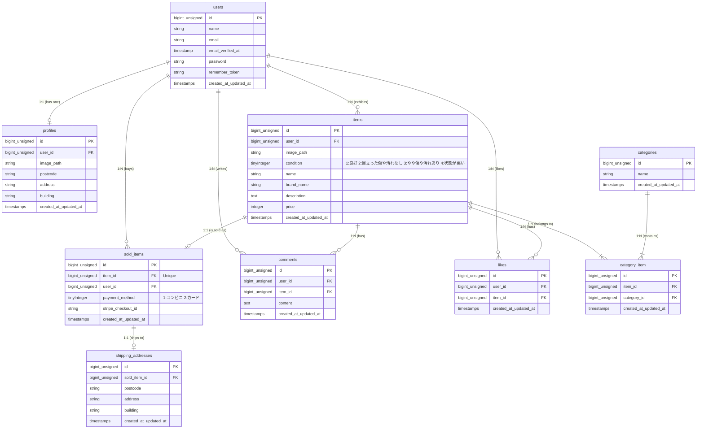

## アプリケーション名

フリマアプリ

## 環境構築

**Docker ビルド**

- git clone git@github.com:sappy3105/contact-form-test.git
- cd contact-form-test
- docker-compose up -d --build

**Laravel 環境構築**

- docker-compose exec php bash
- composer install
- cp .env.example .env , 環境変数を適宜変更
- php artisan key:generate
- php artisan migrate
- php artisan db:seed

## URL

- 開発環境： http://localhost/
- phpMyAdmin： http://localhost:8080/

## 使用技術（実行環境）

- PHP 8.1.34
- Laravel 8.83.29
- MySQL 8.0.26
- nginx 1.21.1

## ER 図

